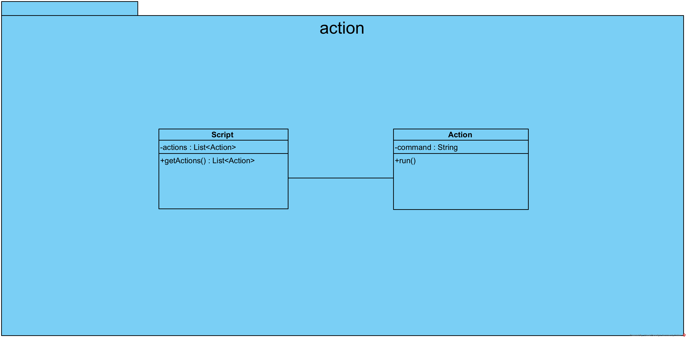
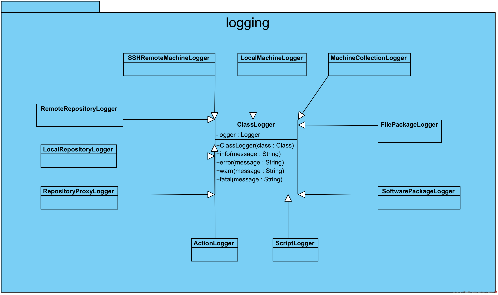
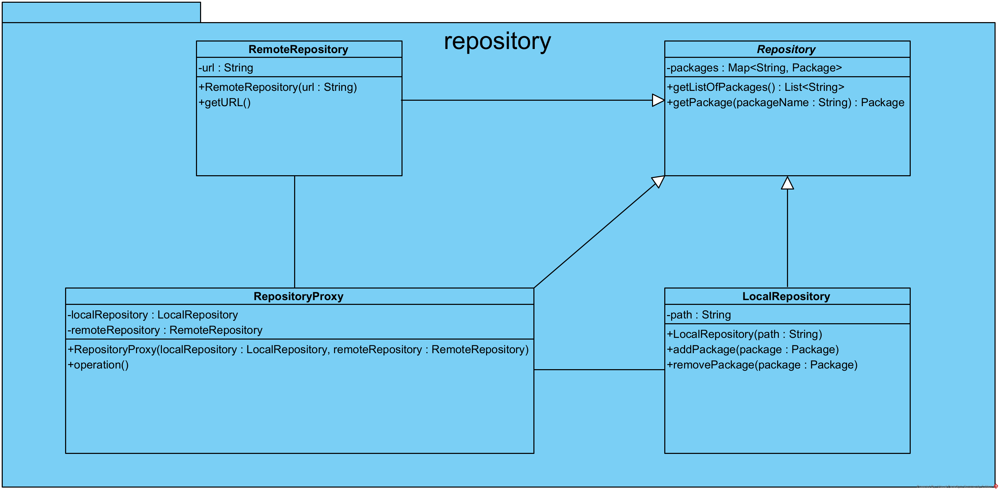

# Agile

## Visual Paradigm

project file is `dotj.vpp`

## UML diagrams

### Class Diagrams

#### package system.action

#### package system.logging

#### package system.machine

#### package system.packaging

#### package system.repository

### Package Diagrams

#### package system

