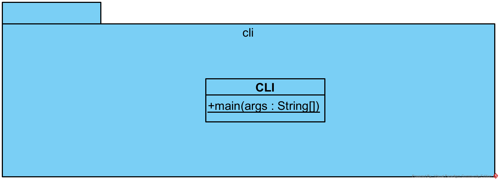
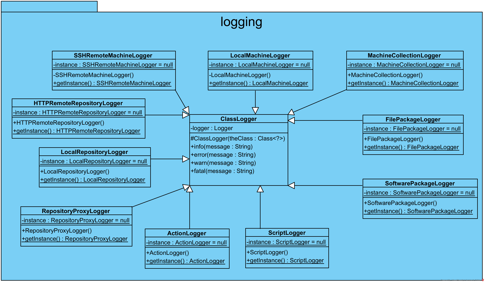

# Agile

## Visual Paradigm

project file is `dotj.vpp`

## UML diagrams

### Class Diagrams

#### package system.action

#### package system.beans

#### package system.cli

#### package system.distro

#### package system.json

#### package system.logging

#### package system.machine

#### package system.packaging

#### package system.repository

#### package system.terminal

#### package system.yaml

### Package Diagrams

#### package system

