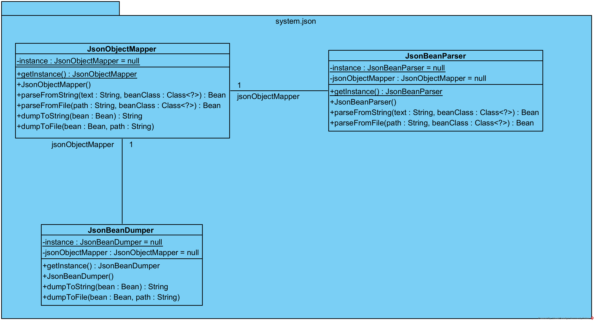
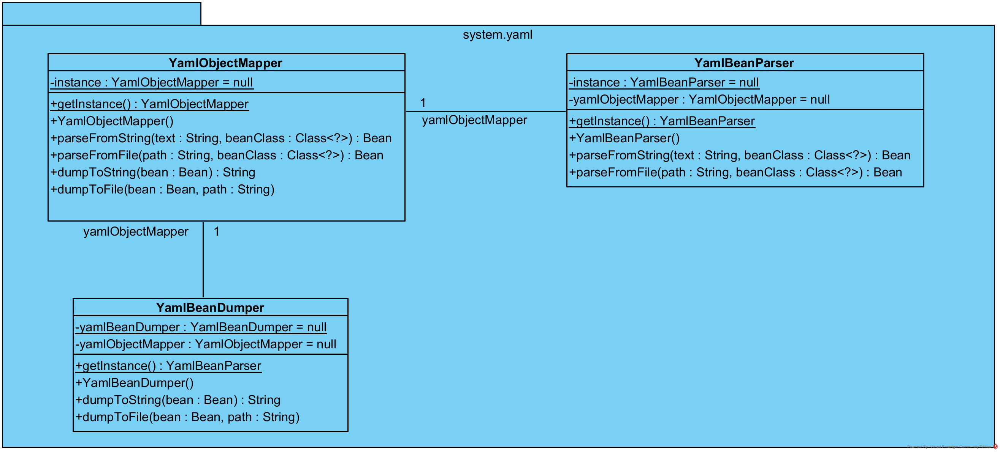
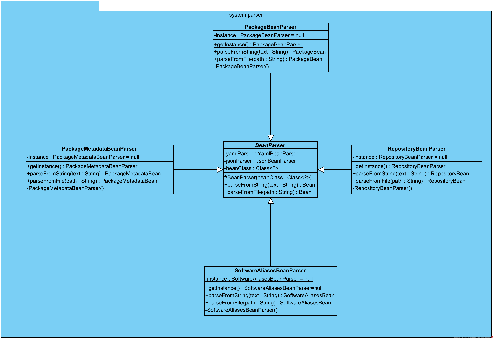
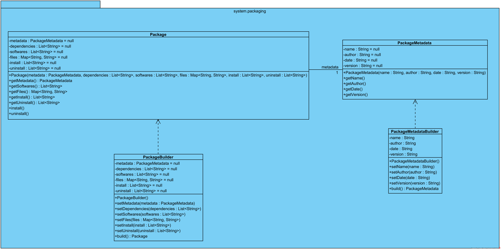
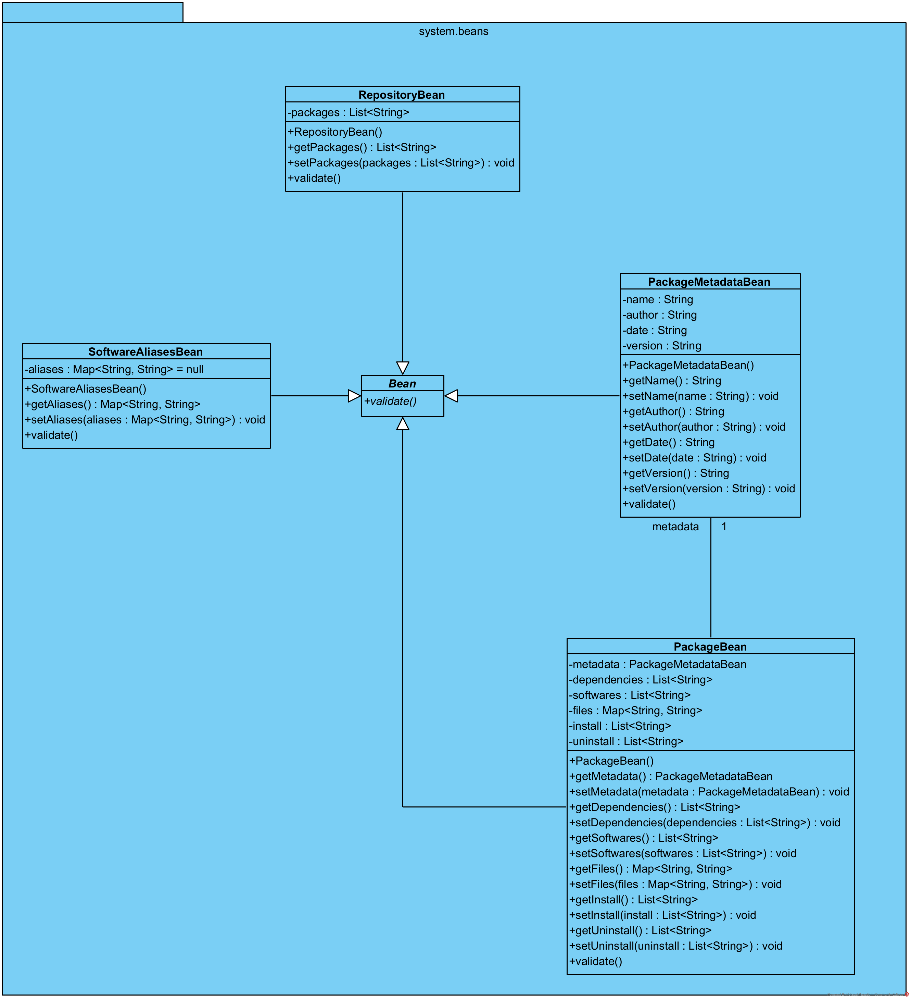

# Agile

## Visual Paradigm

project file is `dotj.vpp`

## UML diagrams

### Class Diagrams

#### package system.json

#### package system.yaml

#### package system.parser

#### package system.packaging

#### package system.repository

#### package system.beans

#### package system.main

#### package system.temp

Si applica il Design Pattern *Facade*: la classe TemporaryFactory contiene una interfaccia unificata per le operazioni di creazione di TemporaryFile e TemporaryDirectory.

#### package system.terminal

Si applica il Design Pattern *Facade*: la classe Terminal contiene una interfaccia unificata per le operazioni gestite da FileManager, SoftwareManager e DirectoryManager.

Si applica il Design Pattern *Singleton*: le classi Terminal, FileManager, SoftwareManager e DirectoryManager sono progettate per avere un'unica istanza.

Si applica il Design Pattern *Strategy*: le classi concrete APT, DNF e Pacman implementano i servizi promessi dalla classe astratta SoftwareManager.

#### package system

